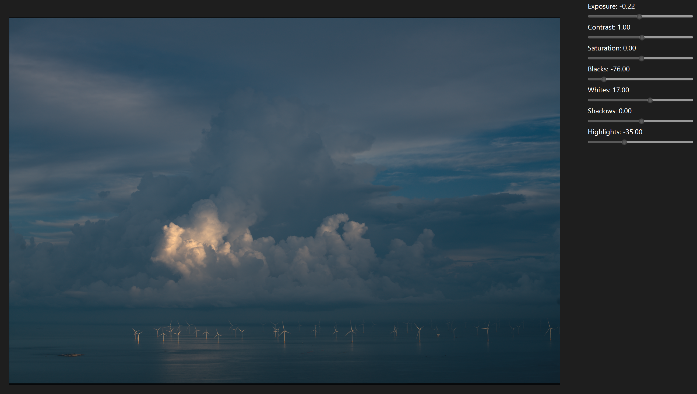

# Pu-erh Lab 🍵

   

**Pu-erh Lab** is an open-source RAW photo processor and digital asset management (DAM) system, similar in vision to darktable and RawTherapee. It provides non-destructive RAW development, high-performance image processing, and a professional workflow engine built in modern C++.

> ⚠️ **Note:** This project is currently in the **very early stages of development (Pre-Alpha)**. Features are subject to change, and the codebase is under active construction.

## 📷 Early Demo Screenshot

<figure>
  
  <figcaption style="text-align:center; font-size:14px; color:gray;">
    Shot with Sony A7RIII · Applied <strong>2383 LUT</strong> · Demo Screenshot
  </figcaption>
</figure>

## 🎯 Vision

Pu-erh Lab aims to provide a professional-grade workflow for photographers, combining robust asset management with a non-destructive, node-based editing pipeline. We focus on performance, usability, and extensibility.

## ✨ Key Technical Features 

### 🚀 High-Performance Core
- **Concurrency First:** Built on a tile-based rendering mechanism to maximize multi-core CPU utilization during image processing.
- **Modern C++:** Written in C++20, trying to be **_blazingly fast_**!
- **GPU Acceleration:** Support GPU-accelerated processing using CUDA for real-time editing performance.

### 🎨 Professional Imaging Pipeline
- **RAW Support:** GPU accelerated decoding module with an integration with **LibRaw** for RAW file unpacking.
- **Color Management:** Support for **ACES** workflows (not really, there are only few IDTs available for digital cameras) with LUT-based stylization.
- **Non-Destructive Editing:** A flexible serializable architecture allows for infinite undo/redo and adjustment layering without altering original files.

### 🗃️ Asset Management ("Sleeve" System)
- **Sleeve Virtual FS:** A custom abstraction layer designed specifically for handling massive photo libraries, providing efficient caching and path resolution.
- **DuckDB Integration:** Utilizes **DuckDB** as an embedded analytical database engine for lightning-fast metadata querying and filtering across thousands of images.

## 🛠️ Tech Stack

*   **Language:** C++20
*   **Build System:** CMake
*   **Package Manager:** vcpkg, TBD
*   **Core Libraries:**
    *   **Image Processing:** OpenCV, LibRaw, OpenColorIO
    *   **Data & Storage:** DuckDB, nlohmann::json, xxHash
    *   **Concurrency:** moodycamel::ConcurrentQueue
    *   **Metadata:** Exiv2
    *   ***Working in progress...***

## 🚧 Development Status

We are currently working on the foundational architecture:

- [x] CMake & vcpkg build infrastructure setup
- [x] Basic RAW image decoding (LibRaw integration)
- [x] "Sleeve" filesystem abstraction layer
- [x] Basic pipeline model
- [ ] User Interface (UI) implementation
- [ ] Non-destructive edit history serialization
- [ ] GPU acceleration support

The detailed development roadmap can be found [here](https://github.com/zidage/PuerhLab/blob/main/docs/roadmap/roadmap.md).

## 🔨 Building from Source

**Prerequisites:**
*   C++ Compiler supporting C++20 (MSVC, Clang, has not been tested with GCC yet)
*   CMake 3.20+
*   Git

**Build Steps:**
It is possible to build Pu-erh Lab right from the repository using CMake and vcpkg on Windows. But the dependencies list is still evolving, so please be patient.
```bash
# Clone the repository
git clone --recursive https://github.com/your-username/pu-erh_lab.git
cd pu-erh_lab

# Configure with CMake (vcpkg will bootstrap automatically)
cmake -B build -S . -DCMAKE_TOOLCHAIN_FILE=vcpkg/scripts/buildsystems/vcpkg.cmake

# Build
cmake --build build --config Release


