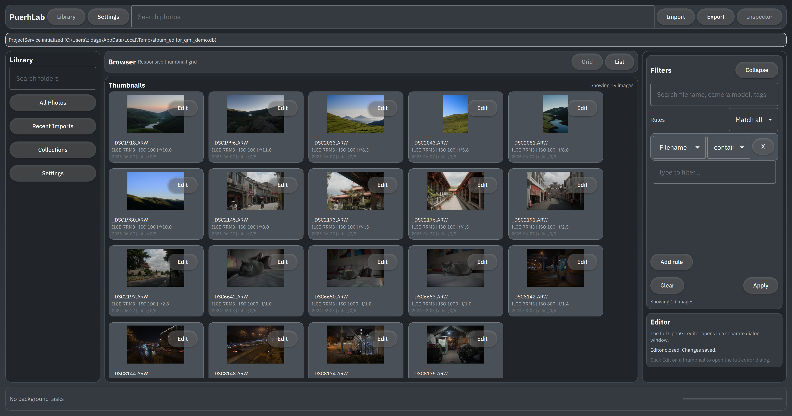
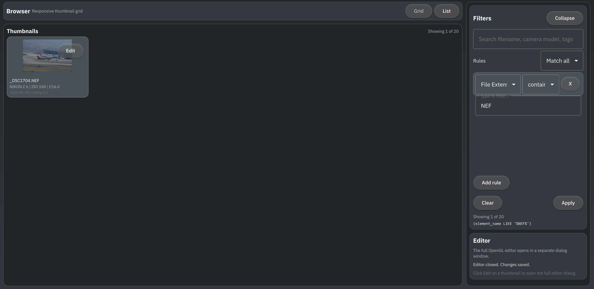
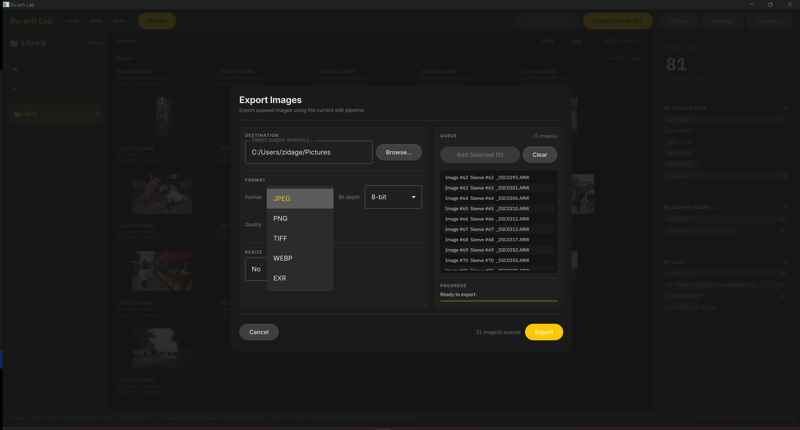

# Pu-erh Lab

<p align="right"><a href="./README.md"><strong>English</strong></a> | <a href="./README.zh-CN.md">简体中文</a></p>


**Pu-erh Lab** is an open-source RAW photo editor and digital asset management (DAM) project. It is designed to provide a new choice to photographers who seek a lightweight, high-performance, and largely industry-compatible workflow for their photo editing and library management needs. 

>Pu-erh Lab is _**NOT an alternative**_ to the existing commercial software nor other open-source projects.


## Early Demo

Video: [BiliBili](https://www.bilibili.com/video/BV1bPcxzzEeM)

<table>
  <colgroup>
    <col style="width: 80%" />
    <col style="width: 20%" />
  </colgroup>
  <tbody>
    <tr>
      <td></td>
      <td>Modern UI Interface</td>
    </tr>
    <tr>
      <td></td>
      <td>Advanced Adjustment Controls</td>
    </tr>
    <tr>
      <td></td>
      <td>LUT Support / Unlimited History Stack / Git-like Version Control</td>
    </tr>
    <tr>
      <td></td>
      <td>Lens Correction Support</td>
    </tr>
    <tr>
      <td></td>
      <td>Advanced Exporting Feature</td>
    </tr>
  </tbody>
</table>

## Key Technical Features

### High-Performance Core

- CUDA-accelerated image processing pipeline with the highest real-time preview resolution running at **60 FPS** on modern GPUs with large RAW files (e.g., 45MP).
- Fine-grained memory management and caching strategies to optimize memory usage especially for large library browsing. The average DRAM usage for browsing a library of **786 42MP RAW** files is around **767MB** while achieving smooth scrolling and instant preview generation.
- Written in modern C++20 with a focus on code quality, modularity, and maintainability (unfortunately, still largely a WIP).

### Professional Imaging Pipeline

- 32-bit floating-point processing pipeline.
- Support **ACES 2.0 Output Rendering**.
- Film-like highlight transition and sigmoid contrast curve.
- **CUBE** LUT support for creative color grading.
- Support JPEG/TIFF/PNG/EXR output with metadata write-back.
- Unlimited history stack with Git-like version control and branching.
- OpenImageIO/Exiv2-based image output with support for various formats and metadata handling.
- Planning to support HDR workflow and output in the future.

### Asset Management ("Sleeve" System)

- A simple but flexible inode-like file system using DuckDB as the storage backend, designed to manage both the original RAW files and the generated metadata (previews, thumbnails, edit history, etc.) in a unified way.
- Lean project management with a single project file that contains all the metadata and references to the original files, enabling easy project sharing and backup without worrying about missing sidecar files or broken links.
- Advanced search and filtering capabilities based on EXIF metadata. Planning to support semantic search and AI-assisted tagging in the future.

## System Requirements

- Windows 10/11 x64 (Linux and macOS support are planned but not yet available in the early stages)
- NVIDIA GPU with CUDA support (minimum compute capability 6.0 (10-series or later), recommended 7.0+ (20-series or later) for optimal performance) and preferably 6GB+ VRAM for smooth performance with high resolution RAW files (40MP+).
- At least 8GB of system RAM (16GB+ recommended for larger libraries and smoother performance).
- 500MB of free disk space for the installation and temporary working files.
- 60+ MB for installation package and partial update support.

## Build from Source (Windows Only)

This section is intentionally Windows-focused and mirrors the current build setup in `CMakeLists.txt` and `CMakePresets.json`.

### 1) Prerequisites

- Windows 10/11 x64
- Visual Studio 2022 (MSVC toolchain, x64)
- CMake 3.21+
- Ninja
- Qt 6 (MSVC 2022 x64), including modules used by the project
- Git
- NVIDIA CUDA Toolkit (enables CUDA targets automatically when found)

### 2) Dependency Resolution in CMake

The top-level CMake currently requires/resolves:

- Qt6: `Widgets`, `Quick`, `OpenGL`, `OpenGLWidgets` (plus app QML module in `src/ui/puerhlab_main/qml`)
- Core libs: `OpenCV`, `Eigen3`, `OpenGL`, `glad`, `hwy`, `lcms2`, `OpenColorIO`, `OpenImageIO`, `libraw`, `xxHash`
- Parallelism/testing: `OpenMP`, `googletest` (via `FetchContent`)
- Windows-specific profiling: `easy_profiler`
- Local third-party imported binaries: DuckDB from `pu-erh_lab/third_party/libduckdb-windows` (fallback Exiv2 path is also defined)

### 3) Configure and Build

Clone and initialize submodules:

```powershell
git clone --recursive https://github.com/zidage/PuerhLab.git
cd PuerhLab
```

Bootstrap local vcpkg if needed:

```powershell
.\vcpkg\bootstrap-vcpkg.bat
```

Recommended: use `scripts/msvc_env.cmd` so MSVC environment variables are set automatically.
Adjust the Qt/easy_profiler paths below to your local environment.

```powershell
# Debug configure
.\scripts\msvc_env.cmd --preset win_debug `
  -DCMAKE_PREFIX_PATH="D:/Qt/6.9.3/msvc2022_64/lib/cmake" `
  -Deasy_profiler_DIR="$PWD/pu-erh_lab/third_party/easy_profiler-v2.1.0-msvc15-win64/lib/cmake/easy_profiler"

# Debug build
.\scripts\msvc_env.cmd --build build/debug --parallel
```

```powershell
# Release configure
.\scripts\msvc_env.cmd --preset win_release `
  -DCMAKE_PREFIX_PATH="D:/Qt/6.9.3/msvc2022_64/lib/cmake" `
  -Deasy_profiler_DIR="$PWD/pu-erh_lab/third_party/easy_profiler-v2.1.0-msvc15-win64/lib/cmake/easy_profiler"

# Release build + install
.\scripts\msvc_env.cmd --build build/release --parallel
.\scripts\msvc_env.cmd --install build/release --prefix build/install
```

Optional deploy tuning:

```powershell
# Include software OpenGL fallback DLL in the install package (larger package).
-DPUERHLAB_DEPLOY_SOFTWARE_OPENGL=ON

# Pass extra options to Qt deploy tooling (semicolon-separated list).
-DPUERHLAB_QT_DEPLOY_TOOL_OPTIONS="--no-compiler-runtime;--no-translations;--no-system-d3d-compiler;--no-system-dxc-compiler"
```

Create a ZIP package (CPack):

```powershell
cpack --config build/release/CPackConfig.cmake
```

### 4) Run Demo Binaries

Common demo executables after a Debug build:

```powershell
.\build\debug\pu-erh_lab\tests\CompleteUIDemo.exe
.\build\debug\pu-erh_lab\tests\ThumbnailAlbumQtDemo.exe
.\build\debug\pu-erh_lab\tests\ImagePreview.exe
.\build\debug\pu-erh_lab\src\puerhlab_main.exe
```

### 5) Tests and Dev Utilities

- Several tests are currently runnable as standalone executables under `build\debug\pu-erh_lab\tests\`.
- During app-layer refactoring, some historical unit tests are intentionally disabled in `pu-erh_lab/tests/CMakeLists.txt`.
- Formatting/lint targets are available (clang-tidy is not fully set up yet):

```powershell
.\scripts\msvc_env.cmd --build build/debug --target format
.\scripts\msvc_env.cmd --build build/debug --target tidy
```

## Roadmap

Roadmap and ongoing milestones:

- [docs/roadmap/roadmap.md](docs/roadmap/roadmap.md)

## License

Apache-2.0. See [LICENSE](LICENSE).
