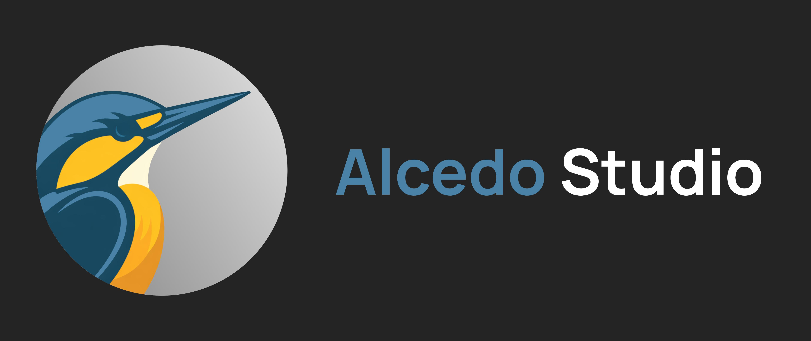
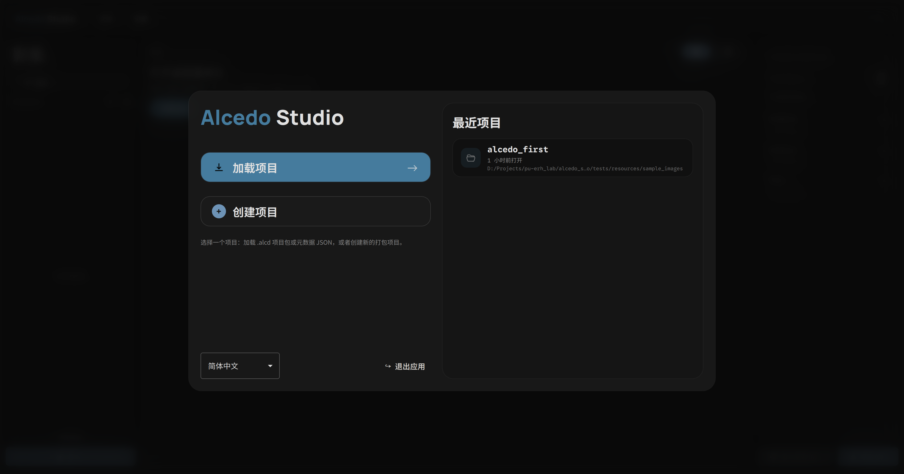
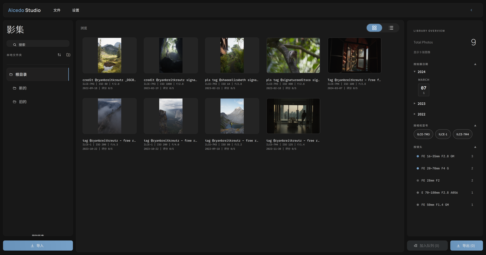
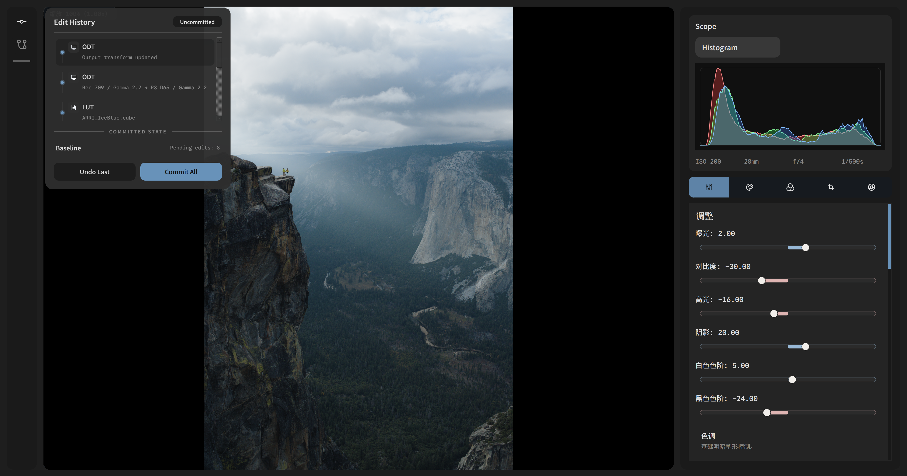
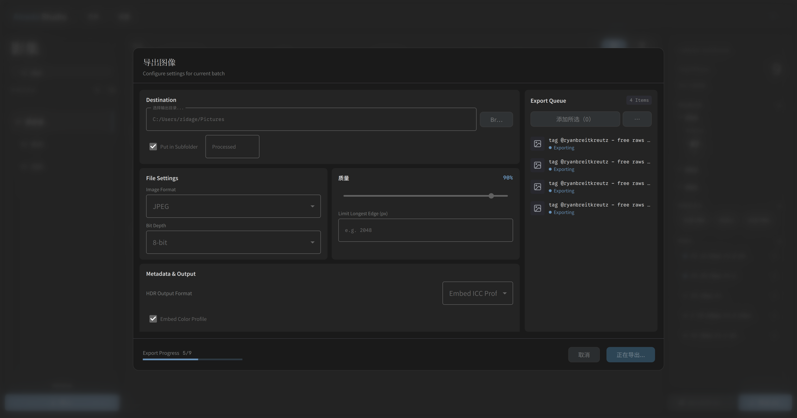

[Project website](https://zidage.github.io/AlcedoStudio) | [项目网页](https://zidage.github.io/AlcedoStudio)

<p align="right"><a href="./README.md"><strong>English</strong></a> | <a href="./README.zh-CN.md">简体中文</a></p>


**Alcedo Studio** is an open-source RAW photo editor and digital asset management (DAM) project. It is designed to provide a new choice to photographers who seek a lightweight, high-performance, and largely industry-compatible workflow for their photo editing and library management needs. 

>Alcedo Studio is _**NOT an alternative**_ to the existing commercial software nor other open-source projects.


## Screenshots and Demo

<table>
  <colgroup>
    <col style="width: 80%" />
    <col style="width: 20%" />
  </colgroup>
  <tbody>
    <tr>
      <td></td>
      <td>Welcome screen — load or create a project from a single branded entry point</td>
    </tr>
    <tr>
      <td></td>
      <td>Library browser — folder tree, responsive thumbnail grid, and a Library Overview panel with date / camera / lens facets</td>
    </tr>
    <tr>
      <td></td>
      <td>HSL and CDL Lift / Gain wheels alongside a live Waveform scope</td>
    </tr>
    <tr>
      <td></td>
      <td>Switchable color science — ACES 2.0 or OpenDRT with display colour space, EOTF, and peak-luminance controls</td>
    </tr>
    <tr>
      <td></td>
      <td>.cube LUT library with search, folder scan, and one-click apply</td>
    </tr>
    <tr>
      <td></td>
      <td>Branchable edit history — undo, collapse, or branch from any prior state</td>
    </tr>
    <tr>
      <td></td>
      <td>Export queue — batch export with format, bit-depth, resize, and metadata options</td>
    </tr>
  </tbody>
</table>

>RAW files are from [signatureedits](https://www.signatureedits.com/free-raw-photos/) 100% Free Raw Files.

## Key Technical Features

### High-Performance Core

- CUDA-accelerated image processing pipeline with the highest real-time preview resolution running at ***300 FPS*** on modern NVIDIA GPUs with large RAW files (e.g., 45MP). Even the full-resolution 42MP preview generation takes only around **20ms** on a mid-range GPU (RTX 3080 Laptop 8GB).
- Fine-grained memory management and caching strategies to optimize memory usage especially for large library browsing. The average DRAM usage for browsing a library of **786 42MP RAW** files is around **767MB** while achieving smooth scrolling and instant preview generation.
- Written in modern C++20 with a focus on code quality, modularity, and maintainability (unfortunately, still largely a WIP).

### Professional Imaging Pipeline

- 32-bit floating-point processing pipeline.
- Support **ACES 2.0 Output Rendering**.
- Film-like highlight transition and sigmoid contrast curve.
- **CUBE** LUT support for creative color grading.
- Support JPEG/TIFF/PNG/EXR output with metadata write-back.
- Unlimited history stack with Git-like version control and branching.
- OpenImageIO/Exiv2-based image output with support for various formats and metadata handling.
- Planning to support HDR workflow and output in the future.

### Asset Management ("Sleeve" System)

- A simple but flexible inode-like file system using DuckDB as the storage backend, designed to manage both the original RAW files and the generated metadata (previews, thumbnails, edit history, etc.) in a unified way.
- Lean project management with a single project file that contains all the metadata and references to the original files, enabling easy project sharing and backup without worrying about missing sidecar files or broken links.
- Advanced search and filtering capabilities based on EXIF metadata. Planning to support semantic search and AI-assisted tagging in the future.

## System Requirements

- Windows 10/11 x64 for the current CUDA editor build, which now defaults to the Qt RHI/D3D12 viewer path.
- macOS on Apple platforms for the Metal-backed Qt application build. 
- NVIDIA GPU with CUDA support (minimum compute capability 6.0 (10-series or later), recommended 7.0+ (20-series or later) for optimal performance) and preferably 6GB+ VRAM for smooth performance with high resolution RAW files (40MP+) on the Windows/CUDA build.
- A Metal-capable Mac for the macOS/Metal build.
- At least 8GB of system RAM (16GB+ recommended for larger libraries and smoother performance).
- 500MB of free disk space for the installation and temporary working files.
- 60+ MB for installation package and partial update support.

## Build from Source

Detailed bilingual instructions are in:
- [docs/build_from_source.md](docs/build_from_source.md)

构建细节（中英对照）已单独维护在：
- [docs/build_from_source.md](docs/build_from_source.md)

Quick commands:

```powershell
# Required submodules for current CMake layout
git submodule update --init --recursive `
  alcedo_studio/src/third_party/lensfun `
  alcedo_studio/src/third_party/libultrahdr `
  alcedo_studio/src/third_party/metal-cpp

# Windows debug (MSVC wrapper + preset)
cmd /c scripts\msvc_env.cmd --preset win_debug -DCMAKE_PREFIX_PATH="D:/Qt/6.9.3/msvc2022_64/lib/cmake"
cmd /c scripts\msvc_env.cmd --build --preset win_debug --parallel 8

# Windows release
cmd /c scripts\msvc_env.cmd --preset win_release -DCMAKE_PREFIX_PATH="D:/Qt/6.9.3/msvc2022_64/lib/cmake"
cmd /c scripts\msvc_env.cmd --build --preset win_release --parallel 8
cmd /c scripts\msvc_env.cmd --install build/release --prefix build/install

# macOS debug and packaging
cmake --preset macos_debug
cmake --build --preset macos_debug --target alcedo_main
cmake --preset macos_release
cmake --build --preset macos_release
cmake --build --preset macos_package
```

## Roadmap

Roadmap and ongoing milestones:

- [docs/roadmap/roadmap.md](docs/roadmap/roadmap.md)

## License

The `v0.1.1` tag and earlier releases remain under Apache-2.0.
Development after `v0.1.1` is licensed under `GPL-3.0-only`, with an additional permission under GPLv3 section 7 for combining/distributing required NVIDIA CUDA components.
See [LICENSE](LICENSE) and [NOTICE](NOTICE).
