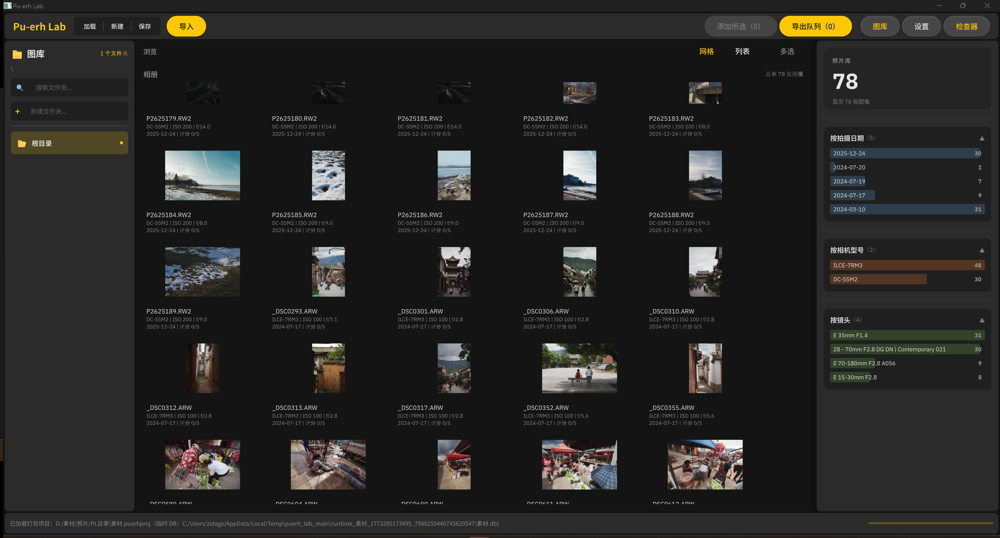
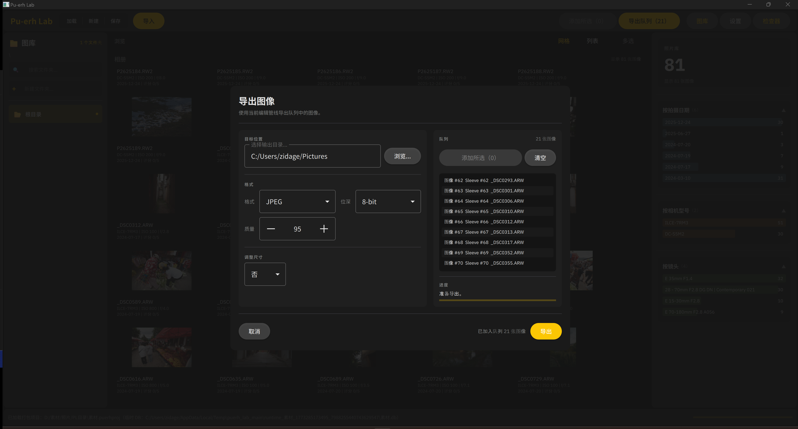

# Alcedo Studio

项目网站：[English](https://zidage.github.io/Alcedo/en/) | [简体中文](https://zidage.github.io/Alcedo/zh/)

<p align="right"><a href="./README.md">English</a> | <a href="./README.zh-CN.md"><strong>简体中文</strong></a></p>


Alcedo Studio (普洱工坊) 是一个开源 RAW 图像处理与数字资产管理（DAM）项目，旨在为摄影师提供一个轻量级、高性能、且在很大程度上兼容行业标准的照片编辑与库管理工作流新选择。

> Alcedo Studio _**不是**_ 现有商业软件或其他开源项目的替代品。

## 早期演示

视频演示1：[BiliBili](https://www.bilibili.com/video/BV1bPcxzzEeM)

视频演示2 (带解说)：[BiliBili](https://www.bilibili.com/video/BV1sFfjBeE3n)

<table>
  <colgroup>
    <col style="width: 80%" />
    <col style="width: 20%" />
  </colgroup>
  <tbody>
    <tr>
      <td></td>
      <td>现代UI界面</td>
    </tr>
    <tr>
      <td></td>
      <td>高级调整控件</td>
    </tr>
    <tr>
      <td></td>
      <td>LUT 支持 / 无限历史记录 / 类 Git 版本控制</td>
    </tr>
    <tr>
      <td></td>
      <td>镜头校正支持</td>
    </tr>
    <tr>
      <td></td>
      <td>高级导出功能</td>
    </tr>
  </tbody>
</table>

## 核心技术特性

### 高性能核心

- CUDA 加速的图像处理管线，有着当前业界领先的实时预览分辨率，能在现代 GPU 上以 60 FPS 流畅处理大尺寸 RAW 文件（例如 45MP）。
- 精细调整的内存管理与缓存策略，优化庞大影像库浏览时的内存使用，平均 DRAM 占用约 767MB（浏览包含 786 张 42MP RAW 文件的库）同时实现流畅滚动和即时预览生成。
- 使用现代 C++20 编写，注重代码质量、模块化和可维护性（估计是个长期老大难问题）。

### 专业图像处理流水线

- 32位浮点图像处理管线。
- 支持ACES 2.0 的”输出渲染（Output Rendering）“色彩管理体系。
- 负片般的高光过渡算法，适合人像和风光摄影（当然现在还没蒙版，没法让大伙画光）。
- 支持CUBE格式的LUT风格化调色，但需要是ACEScc->ACEScc的LUT。
- 支持带元数据写回的 JPEG/TIFF/PNG/EXR 输出。
- 无限的历史栈（^Z, ^Z, ^Z...），并且支持类似 Git 的版本控制（仅分支），可以随时回退到任意历史状态，或在不同版本之间切换对比。
- 基于OpenImageIO/Exiv2的影像元数据处理。
- 计划未来支持 HDR 工作流和输出（方便大家发小红书）。

### 资产管理（Sleeve 系统）

- 简单但灵活的inode式内置文件系统，基于数据库存储，支持文件夹和文件的层级结构。
- 简单精炼的项目文件，仅需一个 `.alcd` 文件即可保存整个项目的状态（包括库结构、每张照片的编辑历史和版本信息等），方便迁移和备份。
- 高级搜索和过滤功能，支持按文件名、拍摄日期、相机型号、镜头型号、曝光参数等多种条件组合搜索照片。
- 计划未来支持语义搜索（例如搜索“拍摄于2023年夏天，使用50mm镜头，光圈f/1.8，拍摄人像的照片”）。

## 系统要求

- Windows 10/11 x64：当前完整 CUDA/OpenGL 编辑器构建目标平台。
- macOS：当前提供面向 Apple 平台的 Metal 后端 Qt 主应用构建；现有 preset 会关闭传统 OpenGL 编辑器，但保留 Apple 原生图像处理后端。
- Windows/CUDA 构建建议使用支持 CUDA 的 NVIDIA GPU（最低计算能力 6.0，即 10 系列或更高；推荐 7.0+，即 20 系列或更高），并尽量配备 6GB+ VRAM 以流畅处理高分辨率 RAW 文件（40MP+）。
- macOS/Metal 构建需要支持 Metal 的 Mac 硬件。
- 至少 8GB 系统内存（建议 16GB+ 以获得更大的库和更流畅的性能）。
- 500MB 可用磁盘空间用于安装和临时工作文件。
- 60MB+ 用于安装包和部分更新支持。

## 源码构建

本节内容对齐当前 `CMakeLists.txt`、`alcedo/tests/CMakeLists.txt` 与 NOTICE 文件。

### Windows（当前完整功能集）

### 1）环境要求

- Windows 10/11 x64
- Visual Studio 2022（MSVC x64 工具链）
- CMake 3.21+
- Ninja
- Git
- Qt 6（MSVC 2022 x64），需包含 `Widgets`、`Quick`、`OpenGL`、`OpenGLWidgets`、`Test`
- NVIDIA CUDA Toolkit（可选，但推荐）

### 2）CMake 依赖布局

- 仓库内置头文件/源码依赖：`stduuid`、`uuid_v4`、`UTF8-CPP`（`utfcpp`）、`nlohmann/json`、`MurmurHash3`
- 包管理依赖（Windows 下通常通过 vcpkg toolchain 解析）：`OpenCV`、`Eigen3`、`OpenGL`、`hwy`、`lcms2`、`OpenColorIO`、`OpenImageIO`、`libraw`、`xxHash`、`OpenMP`、`glib`
- 测试框架：`googletest`（通过 `FetchContent` 获取）
- Windows 本地导入二进制：`DuckDB`、`Exiv2`、`easy_profiler`
- 镜头校正依赖：上游 `Lensfun` 源码子模块位于 `alcedo/src/third_party/lensfun`，由顶层 CMake 自动构建
- Ultra HDR 依赖：上游 `libultrahdr` 源码子模块位于 `alcedo/src/third_party/libultrahdr`，由顶层 CMake 以 git submodule 方式接入
- Lensfun 的 Windows 额外依赖：`GLib2`。启用 vcpkg toolchain 时，Alcedo Studio 会优先自动使用 `vcpkg/installed/<triplet>` 下的 GLib2；`ALCEDO_LENSFUN_GLIB2_BASE_DIR` 仅在你需要覆盖该自动检测结果，或使用非 vcpkg 的 GLib2 包时才需要手动指定

### 3）初始化内置源码子模块

在配置 Alcedo Studio 之前，先确保 `Lensfun` 和 `libultrahdr` 子模块都已经拉取：

```powershell
git submodule update --init --recursive `
  alcedo/src/third_party/lensfun `
  alcedo/src/third_party/libultrahdr
```

Windows 下 bundled Lensfun 构建所需的 GLib2 说明见：

- [docs/lensfun_build/lensfun_local_build.zh-CN.md](docs/lensfun_build/lensfun_local_build.zh-CN.md)

### 4）配置并编译 Alcedo Studio

先拉取源码与子模块：

```powershell
git clone --recursive https://github.com/zidage/Alcedo.git
cd Alcedo
```

如果之前不是用 `--recursive` 拉下来的，请在配置前补拉源码子模块：

```powershell
git submodule update --init --recursive `
  alcedo/src/third_party/lensfun `
  alcedo/src/third_party/libultrahdr
```

如需初始化本地 vcpkg：

```powershell
.\vcpkg\bootstrap-vcpkg.bat
```

推荐使用 `cmd /c scripts\msvc_env.cmd ...` 自动注入 MSVC 构建环境。
下面命令中的 Qt/easy_profiler 路径请按本机实际目录调整。

```powershell
# Debug 配置
cmd /c scripts\msvc_env.cmd --preset win_debug `
  -DCMAKE_PREFIX_PATH="D:/Qt/6.9.3/msvc2022_64/lib/cmake" `
  -Deasy_profiler_DIR="$PWD/alcedo/third_party/easy_profiler-v2.1.0-msvc15-win64/lib/cmake/easy_profiler"

# Debug 编译
cmd /c scripts\msvc_env.cmd --build --preset win_debug --parallel 4
```

```powershell
# Release 配置
cmd /c scripts\msvc_env.cmd --preset win_release `
  -DCMAKE_PREFIX_PATH="D:/Qt/6.9.3/msvc2022_64/lib/cmake" `
  -Deasy_profiler_DIR="$PWD/alcedo/third_party/easy_profiler-v2.1.0-msvc15-win64/lib/cmake/easy_profiler"

# Release 编译 + 安装
cmd /c scripts\msvc_env.cmd --build --preset win_release --parallel 4
cmd /c scripts\msvc_env.cmd --install build/release --prefix build/install
```

如果你没有使用 vcpkg 提供的 `glib`，或者想覆盖自动检测到的 GLib2 路径，请额外传入：

```powershell
-DPUERHLAB_LENSFUN_GLIB2_BASE_DIR="<glib2 路径>"
```

可选部署参数：

```powershell
# 在安装包中包含软件 OpenGL 回退 DLL（体积更大）
-DPUERHLAB_DEPLOY_SOFTWARE_OPENGL=ON

# 向 Qt 部署工具传递额外参数（分号分隔）
-DPUERHLAB_QT_DEPLOY_TOOL_OPTIONS="--no-compiler-runtime;--no-system-d3d-compiler;--no-system-dxc-compiler"
```

生成 ZIP 安装包（CPack）：

```powershell
cpack --config build/release/CPackConfig.cmake
```

### 5）运行主程序与 Demo

Debug 构建后常用可执行文件：

```powershell
.\build\debug\alcedo\src\alcedo_main.exe
```

### 6）测试与开发工具

`alcedo/tests/CMakeLists.txt` 当前启用的可执行目标：

- `SampleTest`
- `SingleRawLoad`
- `SingleThumbnailLoad`
- `ColorTempCudaSanityTest`
- `SleeveFSTest`
- `ImportServiceTest`
- `SleeveServiceTest`
- `FilterServiceTest`
- `PipelineServiceTest`
- `EditHistoryMgmtServiceTest`
- `ThumbnailServiceTest`
- `ExportServiceTest`
- `AlbumBackendImportTest`
- `AlbumBackendProjectTest`
- `AlbumBackendFolderTest`
- `AlbumBackendImageDeleteTest`
- `CudaImageGeometryOpsTest`（仅在检测到 CUDA 时启用）

当前通过 CTest 自动发现的测试包括 `PipelineServiceTest`、`EditHistoryMgmtServiceTest` 以及全部 `AlbumBackend*` 目标：

```powershell
ctest --test-dir build/debug --output-on-failure
```

其余可执行测试可直接运行，例如：

```powershell
.\build\debug\alcedo\tests\SampleTest.exe
```

在重构期间，部分历史单测仍处于注释/停用状态。

可用格式化/静态检查目标（clang-tidy 集成仍在完善中）：

```powershell
cmd /c scripts\msvc_env.cmd --build --preset win_debug --target format
cmd /c scripts\msvc_env.cmd --build --preset win_debug --target tidy
```

### macOS（启用 Metal 的主应用构建）

先通过 Homebrew 安装依赖：

```bash
brew install cmake ninja qt opencv opencolorio duckdb exiv2 glib libraw little-cms2 highway openimageio pkg-config xxhash eigen libomp
```

配置并编译主程序：

```bash
git submodule update --init --recursive \
  alcedo/src/third_party/lensfun \
  alcedo/src/third_party/libultrahdr
cmake --preset macos_debug
cmake --build --preset macos_debug --target alcedo_main
```

运行程序：

```bash
./build/macos-debug/alcedo/src/alcedo_main
```

说明：

- `macos_debug` 和 `macos_release` preset 默认关闭 CUDA、传统 OpenGL 编辑器和测试，仅构建主 Qt 应用；在 Apple 平台上则走 Metal 后端路径。
- 如果 Homebrew 不在默认前缀下，请在配置时额外传入 `-DCMAKE_PREFIX_PATH=/path/to/prefix`。
- 当前 macOS 构建目标是让主 Qt 应用运行在 Metal 后端集成路径上，而不是 Windows/CUDA 那条链路；与 Windows 版本相比，部分编辑器层面的能力仍在继续补齐。

## 路线图

开发里程碑见：

- [docs/roadmap/roadmap.md](docs/roadmap/roadmap.md)

## 许可证

`v0.1.1` tag 及之前的发布版本继续遵循 Apache-2.0。
`v0.1.1` 之后的开发版本遵循 `GPL-3.0-only`，并在根 `LICENSE` 中附带一个基于 GPLv3 第 7 节、用于组合/分发必需 NVIDIA CUDA 组件的补充许可。
详见 [LICENSE](LICENSE) 与 [NOTICE](NOTICE)。
