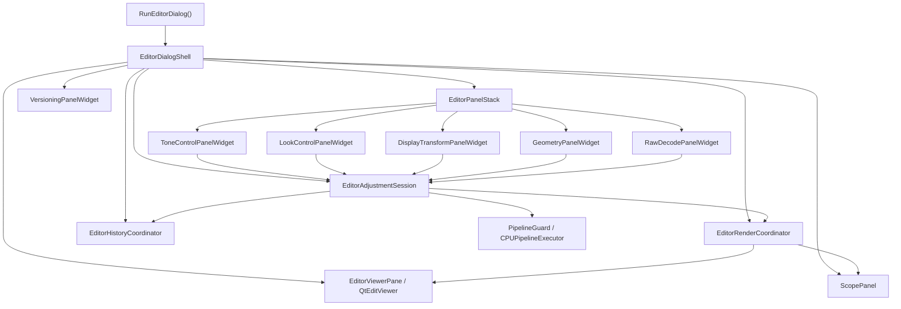

# Editor Dialog Refactor Design

## Purpose

The editor dialog is currently split across several implementation files, but most panel code still belongs to `EditorDialog`. The result is a large dialog class with panel state, panel widgets, transaction logic, preview scheduling, history updates, and pipeline I/O all sharing one declaration surface.

This document defines the target architecture for refactoring the editor dialog into composable widgets without changing editor behavior in one risky pass.

## Current Shape

The current implementation has these important properties:

| Area | Current location | Observation |
| --- | --- | --- |
| Dialog declaration | `alcedo_studio/src/include/ui/alcedo_main/editor_dialog/dialog_internal.hpp` | `EditorDialog` declares shell widgets, panel widgets, panel helper functions, pipeline functions, render scheduling, history functions, and all adjustment controls. |
| Shared UI snapshot | `alcedo_studio/src/include/ui/alcedo_main/editor_dialog/state.hpp` | `AdjustmentState` stores all editor parameters in one struct. |
| Snapshot load and mapping | `alcedo_studio/src/ui/alcedo_main/editor_dialog/dialog_ui_state.cpp`, `modules/pipeline_io.cpp` | Pipeline params are loaded into the global snapshot and mapped back from it. |
| Commit path | `alcedo_studio/src/ui/alcedo_main/editor_dialog/dialog_history.cpp` | `CommitAdjustment()` builds an `EditTransaction`, applies it to the pipeline, appends it to the working version, and updates the committed snapshot. |
| Preview path | `alcedo_studio/src/ui/alcedo_main/editor_dialog/dialog_render.cpp`, `dialog_pipeline.cpp` | Preview requests enqueue a full `AdjustmentState` snapshot. `ApplyStateToPipeline()` writes the snapshot to the pipeline before render. |
| Placeholder widgets | `widgets/*_panel_widget.hpp/.cpp` | The headers declare real widget classes, but the `.cpp` files mostly implement `EditorDialog::Build...()` methods. |

The refactor must preserve the existing two-phase behavior:

1. Fast preview while a control changes.
2. Transaction commit on release, selection, or explicit apply.

Geometry is a special case: while the geometry panel is active, crop edits are overlay-first and the pipeline should render the pre-geometry frame until the crop is committed.

## Selected Pattern

Use a **Presentation Model plus Transaction Mediator** pattern.

In practical terms:

- Each adjustment panel becomes a `QWidget` with its own controls and typed state.
- Each panel owns a small presentation model that knows how to read, validate, format, reset, preview, and commit that module's parameters.
- Panels do not own `PipelineGuard`, `Version`, `PipelineScheduler`, or `ImagePoolService`.
- Panels send all pipeline writes through one mediator: `EditorAdjustmentSession`.
- `EditorDialog` becomes a composition root and shell. It creates the viewer, panel stack, versioning UI, render coordinators, and adjustment session, then wires panel widgets into the session.

This is intentionally not full MVC. Qt widgets already combine view and interaction code well enough for this project. The split that matters here is ownership of adjustment state and ownership of pipeline transactions.

## Design Principles

### 1. Dialog as Shell Only

`EditorDialog` should own:

- Top-level services passed into `RunEditorDialog()`.
- Main shell layout: viewer, scope panel, panel stack, versioning area.
- Lifecycle hooks such as show, resize, close, translation, and shortcuts.
- Coordinators for render, history, and adjustment transactions.
- Pointers to panel widgets only as child widgets, not to their internal sliders, combos, or labels.

`EditorDialog` should not own:

- Slider pointers for adjustment modules.
- Module-specific state fields.
- Module-specific reset callbacks.
- Lens combo state.
- LUT browser selection state.
- CDL wheel labels or widgets.
- ODT detail slider bindings.
- Geometry crop control pointers.

### 2. Panels Own Their Controls and State

Every adjustment panel should be a real class:

```cpp
class ToneControlPanelWidget final : public AdjustmentPanelWidget {
 public:
  explicit ToneControlPanelWidget(EditorAdjustmentSession& session, QWidget* parent = nullptr);

  auto PanelId() const -> AdjustmentPanelId override;
  void LoadFromPipeline() override;
  void ReloadFromCommittedState() override;
  void SetSyncing(bool syncing) override;

 private:
  ToneAdjustmentState state_{};
  ToneAdjustmentState committed_state_{};

  QSlider* exposure_slider_ = nullptr;
  QSlider* contrast_slider_ = nullptr;
  ToneCurveWidget* curve_widget_ = nullptr;
};
```

The panel owns both current draft state and committed state for fields it controls. It asks the session to preview draft changes and commit final changes.

### 3. One Transaction Mediator

`EditorAdjustmentSession` is the only object that translates panel intent into pipeline mutations, history transactions, preview scheduling, and dirty flags.

Panels call methods such as:

```cpp
session.Preview(AdjustmentPatch{
    .field = AdjustmentField::Exposure,
    .params = TonePipelineAdapter::ParamsForExposure(state_),
    .policy = PreviewPolicy::FastViewport,
});

session.Commit(AdjustmentCommit{
    .field = AdjustmentField::Exposure,
    .old_params = TonePipelineAdapter::ParamsForExposure(committed_state_),
    .new_params = TonePipelineAdapter::ParamsForExposure(state_),
});
```

The session owns the common commit algorithm that currently lives in `EditorDialog::CommitAdjustment()`:

1. Resolve stage and operator.
2. Build an `EditTransaction`.
3. Apply the transaction to the pipeline.
4. Append it to the working version.
5. Mark the pipeline dirty.
6. Notify render and versioning coordinators.
7. Notify panels that committed state changed.

### 4. Pipeline Mapping Belongs to Adapters

Do not move all `pipeline_io.cpp` logic directly into widgets. Instead, split it into module adapters:

| Module | Adapter |
| --- | --- |
| Tone | `TonePipelineAdapter` |
| Color temperature | `ColorTempPipelineAdapter` |
| Look, CDL, HLS, LUT | `LookPipelineAdapter` |
| Display transform | `DisplayTransformPipelineAdapter` |
| Geometry | `GeometryPipelineAdapter` |
| Raw decode and lens calibration | `RawPipelineAdapter` |

Adapters are stateless. They convert between typed panel state and pipeline params:

```cpp
struct TonePipelineAdapter {
  static auto Load(CPUPipelineExecutor& exec, const ToneAdjustmentState& base)
      -> PipelineLoadResult<ToneAdjustmentState>;

  static auto ParamsFor(AdjustmentField field, const ToneAdjustmentState& state)
      -> nlohmann::json;

  static auto FieldChanged(AdjustmentField field,
                           const ToneAdjustmentState& current,
                           const ToneAdjustmentState& committed) -> bool;
};
```

This keeps widgets free of pipeline-stage lookup details and keeps transaction code independent of widget controls.

### 5. Typed Module State Replaces the Global Snapshot

The current `AdjustmentState` should become transitional compatibility only. Split it into typed module states:

```cpp
struct ToneAdjustmentState {
  float exposure_ = 1.5f;
  float contrast_ = 0.0f;
  float blacks_ = 0.0f;
  float whites_ = 0.0f;
  float shadows_ = 0.0f;
  float highlights_ = 0.0f;
  std::vector<QPointF> curve_points_ = curve::DefaultCurveControlPoints();
  float saturation_ = 30.0f;
  float sharpen_ = 0.0f;
  float clarity_ = 0.0f;
};

struct ColorTempAdjustmentState {
  ColorTempMode mode_ = ColorTempMode::AS_SHOT;
  float custom_cct_ = 6500.0f;
  float custom_tint_ = 0.0f;
  float resolved_cct_ = 6500.0f;
  float resolved_tint_ = 0.0f;
  bool supported_ = true;
};
```

During migration, `EditorAdjustmentSnapshot` can aggregate typed states so the existing render path can keep applying a full snapshot. The final architecture should render from either:

- a full aggregate snapshot supplied by the session, or
- a pipeline already updated by preview patches.

The first option is safer for incremental migration.

### 6. Preview and Commit Are Separate Concepts

Panels must not apply history transactions while a user drags a slider. They should issue preview updates while editing and commit only on release or explicit selection.

Use two request types:

```cpp
struct AdjustmentPreview {
  AdjustmentField field;
  nlohmann::json params;
  PreviewPolicy policy = PreviewPolicy::FastViewport;
};

struct AdjustmentCommit {
  AdjustmentField field;
  nlohmann::json old_params;
  nlohmann::json new_params;
  CommitPolicy policy = CommitPolicy::AppendTransaction;
};
```

The mediator decides whether a preview should be full-frame, viewport-only, debounce-delayed, or geometry-overlay-only.

### 7. Panel Synchronization Is Explicit

The global `syncing_controls_` flag should be replaced with panel-local sync guards:

```cpp
class ScopedPanelSync {
 public:
  explicit ScopedPanelSync(bool& flag) : flag_(flag), previous_(flag) { flag_ = true; }
  ~ScopedPanelSync() { flag_ = previous_; }

 private:
  bool& flag_;
  bool previous_;
};
```

Each panel suppresses its own control callbacks while loading from pipeline, undo, version checkout, reset, or translation.

## Target File Structure

The final structure should separate shell, coordination, panel widgets, states, and pipeline adapters:

```text
alcedo_studio/src/include/ui/alcedo_main/editor_dialog/
  dialog.hpp
  editor_dialog.hpp
  shell/
    editor_dialog_shell.hpp
    editor_dialog_shell_private.hpp
    editor_panel_stack.hpp
  session/
    editor_adjustment_session.hpp
    adjustment_panel.hpp
    adjustment_patch.hpp
    adjustment_snapshot.hpp
  state/
    tone_adjustment_state.hpp
    color_temp_adjustment_state.hpp
    look_adjustment_state.hpp
    display_transform_adjustment_state.hpp
    geometry_adjustment_state.hpp
    raw_decode_adjustment_state.hpp
  pipeline/
    adjustment_pipeline_adapter.hpp
    tone_pipeline_adapter.hpp
    color_temp_pipeline_adapter.hpp
    look_pipeline_adapter.hpp
    display_transform_pipeline_adapter.hpp
    geometry_pipeline_adapter.hpp
    raw_pipeline_adapter.hpp
  panels/
    tone_control_panel_widget.hpp
    look_control_panel_widget.hpp
    display_transform_panel_widget.hpp
    geometry_panel_widget.hpp
    raw_decode_panel_widget.hpp
    versioning_panel_widget.hpp
  render/
    editor_render_coordinator.hpp
  history/
    editor_history_coordinator.hpp
```

Matching `.cpp` files should live under:

```text
alcedo_studio/src/ui/alcedo_main/editor_dialog/
  shell/
  session/
  state/
  pipeline/
  panels/
  render/
  history/
```

The existing `modules/` folder can remain for pure algorithm helpers such as curve math, geometry math, HLS tables, lens catalog loading, and LUT catalog scanning.

## Final Runtime Structure



## Module Responsibilities

### EditorDialogShell

Owns window-level behavior and composition.

Responsibilities:

- Construct main layout and panel stack.
- Own service references passed into `RunEditorDialog()`.
- Own shell-only shortcuts.
- Route active panel changes.
- Coordinate close and lifecycle behavior.
- Trigger initial load and initial quality preview.

Non-responsibilities:

- No adjustment slider pointers.
- No adjustment state mutation.
- No field-to-operator mapping.
- No `EditTransaction` construction.

### EditorAdjustmentSession

Owns adjustment transaction semantics.

Responsibilities:

- Provide pipeline read access through adapters.
- Accept preview and commit requests from panels.
- Maintain the aggregate draft and committed snapshot during migration.
- Apply preview state to the pipeline for render requests.
- Create and apply `EditTransaction` objects for commits.
- Update `PipelineGuard::dirty_`.
- Notify history and render coordinators after commits.
- Broadcast reload events to panels after undo, version checkout, and pipeline import.

Non-responsibilities:

- No widget construction.
- No control formatting.
- No panel-specific validation beyond rejecting invalid adapter output.

### EditorRenderCoordinator

Owns render scheduling and preview generation.

Responsibilities:

- Replace render methods currently on `EditorDialog`.
- Manage fast, quality, and detail preview timers.
- Own pending render requests and inflight futures.
- Apply snapshot or preview patch through the session before render.
- Update viewer and scope with completed frames.

Non-responsibilities:

- No adjustment state ownership.
- No history transactions.

### EditorHistoryCoordinator

Owns versioning operations.

Responsibilities:

- Load and reconstruct version params.
- Commit working versions.
- Undo uncommitted transactions.
- Start new working versions.
- Maintain `VersioningPanelWidget` view state.
- Request session reload after history operations.

Non-responsibilities:

- No direct panel control mutation.
- No pipeline mapping beyond applying reconstructed params through the session.

### AdjustmentPanelWidget

Base interface for panel widgets.

Responsibilities:

- Expose panel identity.
- Load current and committed state from the session.
- Refresh UI from panel-local state.
- Participate in translation.
- Report whether shortcuts should be consumed locally, when relevant.

Non-responsibilities:

- No direct `PipelineGuard` writes.
- No direct `Version` mutation.
- No preview scheduler access.

### ToneControlPanelWidget

Owns:

- Exposure.
- Contrast.
- Highlights.
- Shadows.
- Whites.
- Blacks.
- Tone curve.
- Saturation, if the team keeps it in the Tone panel.
- Sharpen and clarity, if the team keeps detail controls in the Tone panel.

Uses:

- `ToneAdjustmentState`.
- `TonePipelineAdapter`.
- `ToneCurveWidget`.

### LookControlPanelWidget

Owns:

- HLS target hue and per-hue profile tables.
- CDL lift, gamma, and gain wheels.
- LUT browser selection and LUT navigation shortcuts.

Uses:

- `LookAdjustmentState`.
- `LookPipelineAdapter`.
- `LutBrowserWidget`.
- `CdlTrackballDiscWidget`.

### DisplayTransformPanelWidget

Owns:

- ODT method.
- Encoding color space and EOTF.
- Peak luminance.
- ACES limiting space.
- OpenDRT presets and detail controls.

Uses:

- `DisplayTransformAdjustmentState`.
- `DisplayTransformPipelineAdapter`.

### GeometryPanelWidget

Owns:

- Rotation.
- Crop rectangle.
- Crop aspect preset.
- Custom aspect ratio fields.
- Crop overlay interaction binding.
- Apply and reset controls.

Uses:

- `GeometryAdjustmentState`.
- `GeometryPipelineAdapter`.
- A narrow viewer port, not the full `QtEditViewer` API.

Geometry needs an explicit viewer-facing interface:

```cpp
class GeometryOverlayPort {
 public:
  virtual ~GeometryOverlayPort() = default;
  virtual auto SourceAspectRatio() const -> float = 0;
  virtual void SetCropOverlayVisible(bool visible) = 0;
  virtual void SetCropOverlayRectNormalized(float x, float y, float w, float h) = 0;
  virtual void SetCropOverlayRotationDegrees(float degrees) = 0;
  virtual void SetCropOverlayAspectLock(bool locked, float aspect_ratio) = 0;
};
```

### RawDecodePanelWidget

Owns:

- Highlight reconstruction.
- Lens calibration enablement.
- Lens make and model overrides.
- Lens catalog loading status.

Uses:

- `RawDecodeAdjustmentState`.
- `RawPipelineAdapter`.
- Lens catalog helper functions from `modules/lens_calib.*`.

### VersioningPanelWidget

Owns:

- Versioning panel controls and lists.
- Collapsed and expanded panel UI.
- History and transaction list presentation.

Uses:

- `EditorHistoryCoordinator`.

Versioning is not an adjustment panel. It should not implement `AdjustmentPanelWidget`.

## Migration Compatibility

The safest migration path is to keep `AdjustmentState` alive temporarily as an aggregate compatibility snapshot:

```cpp
struct EditorAdjustmentSnapshot {
  ToneAdjustmentState tone_;
  ColorTempAdjustmentState color_temp_;
  LookAdjustmentState look_;
  DisplayTransformAdjustmentState display_transform_;
  GeometryAdjustmentState geometry_;
  RawDecodeAdjustmentState raw_;
  RenderType type_ = RenderType::FAST_PREVIEW;
};
```

Then provide conversion functions:

```cpp
auto ToLegacyAdjustmentState(const EditorAdjustmentSnapshot& snapshot) -> AdjustmentState;
auto FromLegacyAdjustmentState(const AdjustmentState& state) -> EditorAdjustmentSnapshot;
```

Delete these conversions only after `dialog_pipeline.cpp`, `dialog_render.cpp`, and the history reload path no longer need the legacy snapshot.

## Definition of Done

The refactor is complete when:

- `dialog_internal.hpp` contains only shell-private declarations, not panel control declarations.
- Each panel `.cpp` implements methods on its own panel class, not `EditorDialog::Build...()`.
- No panel directly references `pipeline_guard_`, `working_version_`, or render scheduler internals.
- `AdjustmentState` is removed or reduced to a compatibility type outside the widget layer.
- `pipeline_io.cpp` is split into module pipeline adapters.
- Undo, version checkout, import, reset, fast preview, quality preview, and geometry overlay behavior match the current editor.
